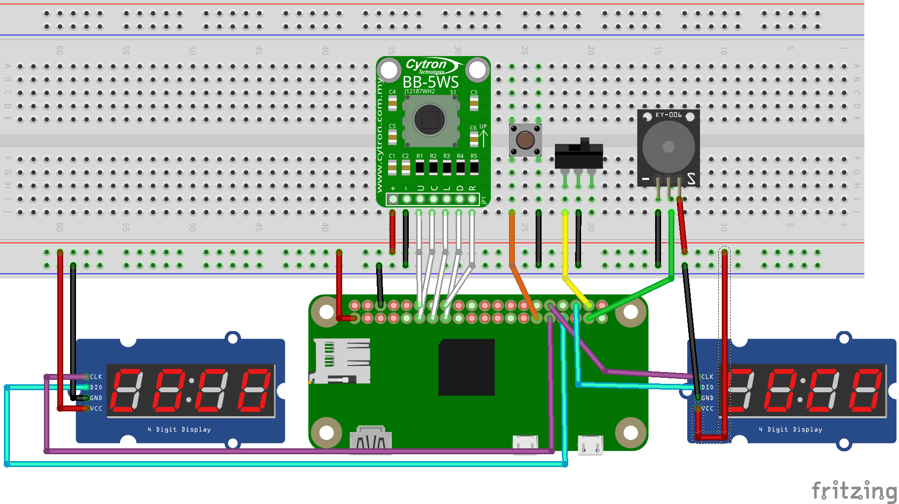

Kitchen-Clock with two countdown-timers (based on TM1637-displays)
==================================================================

Overview
--------

This project implements a double countdown clock (kitchen-timer) using
two TM1637 displays (and some additional components, see below).

The "firmware" uses Python3 and is expected to run on a Raspberry Pi Zero
(or a similar SBC). Porting to a MCU should be an easy task if you have
enough experience.

Hardware
--------

The setup uses the following hardware-components:

  - two TM1637 clock displays
  - one 5-way button for setup
  - one normal button for start/stop
  - optional up to four normal buttons for save/restore ("memory"-buttons)
  - one slider
  - one active buzzer

You can find details on the necessary wiring in `doc/specs.md`.

Software
--------

Run

    git clone https://github.com/bablokb/doubleclock.git
    cd doubleclock
    sudo tools/install

to install the software and some prerequisite packages. This will also enable
a systemd-service so that the clock starts at boot-time.

System-Tweaks
-------------

The clock has no shutdown button, so it is best to configure the system
as a readonly-system. If you have a dedicated Pi for the clock, just remove
the lines from `/etc/fstab` which mount `/` and `/boot`.

To speedup boot-time, disable the keyboard-setup.service. Also, add "quiet"
to `/boot/cmdline.txt`. Of course you have to do this before the system is
in readonly-mode.

In readonly-mode, saving the last state and the memory-buttons don't work.
If you want a readonly-system *and* memory-buttons, create a small
data-partition, mount it in `/etc/fstab` with the option `sync` and
replace `/var/lib/doubleclock` with a symbolic link to your mounted
data-partition.

Usage
-----

Push the 5-way button down to enable or disable setup-mode. In setup-mode the
active digit of the active clock will blink. Use the slider to switch between
clocks. Pushing the button to the left or right will change the active digit,
pushing it up or down will change the value. After setting the alarm-times,
push the button down again to leave setup-mode. Note that pressing the
start/stop-button in setup-mode will reset all values to zero.

Use the start/stop-button to activate the countdown. As soon as a clock
reaches zero, the buzzer will start and the brightness of the display is
reduced. Note that after the alarm starts, the display will continue to
count.

In alarm-mode, the start/stop-button will stop the buzzer, but not the second
running clock. Stopping the second alarm will reset the values to the state
after the last setup.

Pressing a memory-button in setup-mode will save the current values. Pressing
them in ready-mode will recall the values. Independent of the memory-buttons,
the clock will save the last values of the clocks.

Case
----

A case (housing) is work-in-progress. You can find my tinkercad-project
[here](https://www.tinkercad.com/things/8dUa6ugfUpZ).

The case uses PETG, since PLA is not usable in moist environments like a
kitchen. Also, care has to be taken that no electronic components get wet
when water is spilled on the table. Ideally, the clock would be wall-mounted,
but this is not always possible.

The case should also be easy to open and close, in case a component needs
to be replaced. There are too many throw-away gadgets out in the wild, which
stop working only because a wire gets loose and there is no way to open
the gadget without destroying it.

One off the biggest challenges is how to attach the components in a
stable manner. Most of them have either no support at all, or their
mounting holes would result in the breakout to be on the outside.

License
-------

The code in `files/usr/local/sbin/doubleclock.py` is licensed under the GPLv3.

The library in `files/usr/local/sbin/TM1637.py` is from
[https://github.com/bablokb/circuitpython-tm1637](https://github.com/bablokb/circuitpython-tm1637)
and is distributed under a MIT-license.
